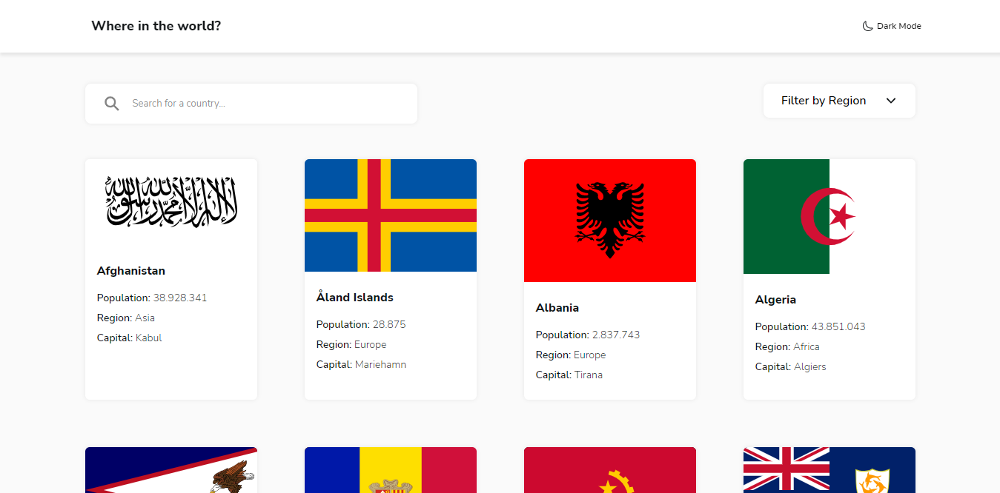

# Frontend Mentor - REST Countries API with color theme switcher solution

This is a solution to the [REST Countries API with color theme switcher challenge on Frontend Mentor](https://www.frontendmentor.io/challenges/rest-countries-api-with-color-theme-switcher-5cacc469fec04111f7b848ca). Frontend Mentor challenges help you improve your coding skills by building realistic projects. 

## Table of contents

- [Overview](#overview)
  - [The challenge](#the-challenge)
  - [Screenshot](#screenshot)
  - [Links](#links)
- [My process](#my-process)
  - [Built with](#built-with)
  - [What I learned](#what-i-learned)
- [Author](#author)
- [How to use the project](#how-to-use-the-project)

## Overview

### The challenge

Users should be able to:

- See all countries from the API on the homepage
- Search for a country using an `input` field
- Filter countries by region
- Click on a country to see more detailed information on a separate page
- Click through to the border countries on the detail page
- Toggle the color scheme between light and dark mode *(optional)*

### Screenshot

### Links

- Solution URL: [Github Repository](https://github.com/DanielMafra/rest-countries-api-with-color-theme-switcher)
- Live Site URL: [Live Demo](https://danielmafra.github.io/rest-countries-api-with-color-theme-switcher)

## My process

### Built with

- Semantic HTML5 markup
- CSS custom properties
- Flexbox
- CSS Grid
- Mobile-first workflow
- [React](https://reactjs.org/) - JS library

### What I learned

With this challenge, I was able to put into practice knowledge about the use of routes with react-router-dom, passing properties through the url, making custom requests to the API. In addition to developing logic for loading and also implementing a dark mode. I was also able to fix new knowledge, creating pre-defined filters as well as through a search input for the user to use, typing letter by letter.

## Author

- Website - [Daniel Mafra](https://danielmafra.github.io)
- Frontend Mentor - [@danielmafra](https://www.frontendmentor.io/profile/DanielMafra)
- LinkedIn - [@danielmafradev](https://linkedin.com/in/danielmafradev)
- Instagram - [@danielmafradev](https://instagram.com/danielmafradev)

## How to use the project

Clone the repository using "git clone". After that use the command "npm install" or "yarn install" to install the dependencies, finally use the command "npm start" or "yarn start" to open the project in the browser.
